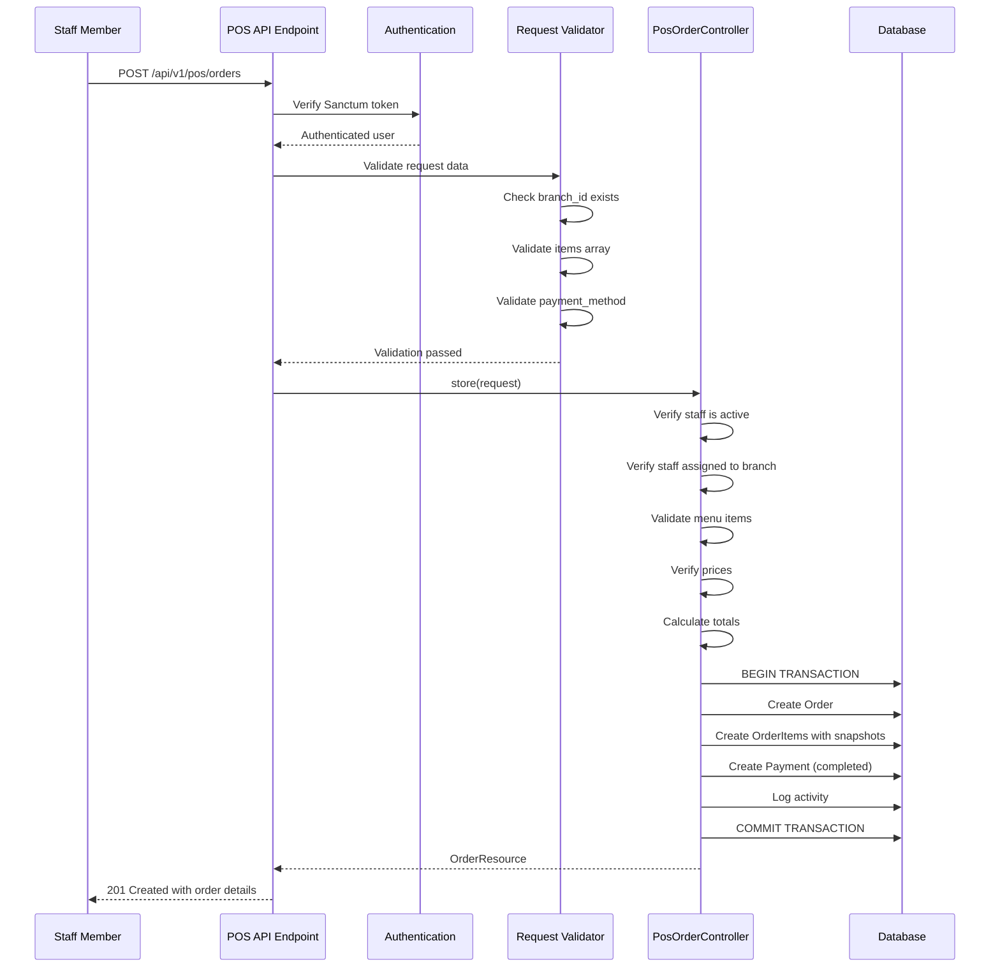

# POS Order Creation - Design Document

## Overview

The POS Order Creation feature provides a backend API endpoint that enables restaurant staff to create orders directly through the Point of Sale system. Unlike the cart-based flow used by online customers, POS orders are created in a single atomic transaction with immediate payment completion.

This design implements a dedicated controller and form request validator that handle POS-specific requirements including staff authentication, branch authorization, menu item validation, price verification, order calculation, and instant payment processing. The implementation follows Laravel 12 conventions and integrates with existing models (Order, OrderItem, Payment, Employee, Branch, MenuItem) while maintaining transaction integrity through database transactions.

Key design decisions:
- Separate POS endpoint from cart-based order creation to avoid coupling different workflows
- Price validation to prevent manual price manipulation by staff
- Atomic transaction handling to ensure data consistency
- Activity logging for audit trail and troubleshooting
- Snapshot preservation of menu items for historical accuracy

## Architecture

### Component Structure

```
app/Http/Controllers/Api/
  └── PosOrderController.php          # Handles POS order creation

app/Http/Requests/
  └── StorePosOrderRequest.php        # Validates POS order requests

app/Models/
  ├── Order.php                       # Existing model (no changes)
  ├── OrderItem.php                   # Existing model (no changes)
  ├── Payment.php                     # Existing model (no changes)
  ├── Employee.php                    # Existing model (no changes)
  ├── Branch.php                      # Existing model (no changes)
  ├── MenuItem.php                    # Existing model (no changes)
  └── MenuItemSize.php                # Existing model (no changes)

routes/
  └── employee.php                    # Add POS routes here
```

### Request Flow



### Data Flow

1. Staff submits order with items, branch, payment method, and customer contact
2. System validates authentication and authorization
3. System validates all menu items belong to branch and prices match
4. System calculates subtotal, tax (2.5%), and total
5. System generates unique order number (CB + 6 digits)
6. System creates order, order items, and payment in single transaction
7. System logs activity for audit trail
8. System returns complete order with relationships

## Components and Interfaces

### PosOrderController

```php
class PosOrderController extends Controller
{
    private const TAX_RATE = 0.025;
    private const PRICE_TOLERANCE = 0.01;

    public function store(StorePosOrderRequest $request): JsonResponse
    {
        // Implementation handles:
        // - Staff authentication and authorization
        // - Branch validation
        // - Menu item validation
        // - Price verification
        // - Order calculation
        // - Transaction management
        // - Activity logging
    }

    private function verifyStaffAuthorization(Employee $employee, int $branchId): void
    private function validateMenuItems(array $items, int $branchId): array
    private function verifyPrices(array $items, array $menuItems): void
    private function calculateOrderTotals(array $items, float $discount): array
    private function generateOrderNumber(): string
    private function createOrderSnapshots(MenuItem $menuItem, ?MenuItemSize $size): array
}
```

### StorePosOrderRequest

```php
class StorePosOrderRequest extends FormRequest
{
    public function authorize(): bool
    public function rules(): array
    public function messages(): array
}
```

### Request Schema

```json
{
  "branch_id": 1,
  "items": [
    {
      "menu_item_id": 5,
      "menu_item_size_id": 2,
      "quantity": 2,
      "unit_price": 25.50
    }
  ],
  "payment_method": "cash",
  "fulfillment_type": "dine_in",
  "contact_name": "John Doe",
  "contact_phone": "0241234567",
  "customer_notes": "Extra napkins please",
  "discount": 5.00
}
```

### Response Schema

```json
{
  "data": {
    "id": 123,
    "order_number": "CB123456",
    "branch_id": 1,
    "assigned_employee_id": 10,
    "order_type": "pickup",
    "order_source": "pos",
    "contact_name": "John Doe",
    "contact_phone": "0241234567",
    "delivery_note": "Fulfillment: dine_in\nExtra napkins please",
    "subtotal": 51.00,
    "delivery_fee": 0.00,
    "tax_rate": 0.025,
    "tax_amount": 1.28,
    "total_amount": 52.28,
    "status": "received",
    "branch": { ... },
    "assignedEmployee": { ... },
    "items": [ ... ],
    "payments": [ ... ]
  }
}
```

## Data Models

### Order Model
- Uses existing Order model with fillable fields
- Relationships: branch, assignedEmployee, items, payments
- Activity logging enabled for status and amount changes

### OrderItem Model
- Uses existing OrderItem model
- Stores menu_item_snapshot and menu_item_size_snapshot as JSON
- Relationships: order, menuItem, menuItemSize

### Payment Model
- Uses existing Payment model
- All POS payments have status "completed" and paid_at timestamp
- customer_id is null for POS orders

### Employee Model
- Uses existing Employee model
- Validates status is "active" for POS operations
- Relationship to branches via many-to-many

### MenuItem and MenuItemSize Models
- Uses existing models for price lookup and validation
- No modifications required

## Correctness Properties


A property is a characteristic or behavior that should hold true across all valid executions of a system—essentially, a formal statement about what the system should do. Properties serve as the bridge between human-readable specifications and machine-verifiable correctness guarantees.

### Property Reflection

After analyzing all acceptance criteria, I identified the following redundancies:
- Requirements 6.1 and 6.2 both test that fulfillment_type maps to order_type "pickup" - combined into one property
- Requirements 7.2-7.6 all test that POS payments are completed immediately - combined into one property
- Requirements 8.3 and 8.4 test contact information storage - combined with delivery note property
- Requirements 9.3 and 9.4 both test null handling for items without variants - combined into one property
- Requirements 10.2-10.5 all test that POS orders have null customer/delivery fields - combined into one property
- Requirements 11.1-11.4 all relate to activity logging - combined into one comprehensive property
- Requirements 14.2-14.4 all test response structure - combined into one property
- Requirements 15.1-15.3 all test price validation - combined into one comprehensive property with tolerance

### Property 1: Order Source Assignment

For any valid POS order request, the created order should have order_source set to "pos".

**Validates: Requirements 1.2**

### Property 2: Employee Assignment

For any valid POS order request by an authenticated staff member, the created order should have assigned_employee_id set to the authenticated staff member's employee ID.

**Validates: Requirements 1.3**

### Property 3: Order Number Format

For any created POS order, the order_number should match the pattern "CB" followed by exactly 6 digits.

**Validates: Requirements 1.4**

### Property 4: Complete Response Structure

For any successfully created POS order, the response should include the order with all required relationships loaded (branch, assignedEmployee, items, payments) and each item should include its menu item details.

**Validates: Requirements 1.6, 14.2, 14.3, 14.4**

### Property 5: Transaction Rollback on Failure

For any POS order creation that encounters a database error, no partial order data (order, order items, or payment records) should exist in the database after the error.

**Validates: Requirements 1.7, 13.2**

### Property 6: Active Staff Authorization

For any staff member with status other than "active", attempting to create a POS order should be rejected with a 403 Forbidden response.

**Validates: Requirements 2.3**

### Property 7: Branch Existence Validation

For any POS order request with a branch_id that does not exist in the database, the request should be rejected with a 422 Unprocessable Entity response.

**Validates: Requirements 3.1**

### Property 8: Staff Branch Authorization

For any staff member and branch combination where the staff member is not assigned to that branch, attempting to create a POS order for that branch should be rejected with a 403 Forbidden response.

**Validates: Requirements 3.2**

### Property 9: Menu Item Existence and Branch Validation

For any POS order, all menu items in the order should exist in the database and belong to the specified branch, otherwise the request should be rejected with a 422 Unprocessable Entity response.

**Validates: Requirements 4.1, 4.2**

### Property 10: Menu Item Variant Validation

For any order item with a menu_item_size_id, that size should exist in the database and belong to the corresponding menu item, otherwise the request should be rejected with a 422 Unprocessable Entity response.

**Validates: Requirements 4.3**

### Property 11: Subtotal Calculation

For any POS order, the subtotal should equal the sum of all order item subtotals, where each item subtotal equals quantity multiplied by unit_price.

**Validates: Requirements 5.1, 5.2**

### Property 12: Tax Calculation

For any POS order, the tax_amount should equal the subtotal (after discount if applicable) multiplied by 0.025, rounded to 2 decimal places.

**Validates: Requirements 5.3, 5.4**

### Property 13: Delivery Fee for POS Orders

For any POS order, the delivery_fee should always be 0.00.

**Validates: Requirements 5.5**

### Property 14: Total Amount Calculation

For any POS order, the total_amount should equal subtotal minus discount (if provided) plus tax_amount plus delivery_fee.

**Validates: Requirements 5.6, 5.7**

### Property 15: Fulfillment Type Mapping

For any POS order with fulfillment_type of either "dine_in" or "takeaway", the order_type should be set to "pickup" and the delivery_note should contain "Fulfillment: {fulfillment_type}".

**Validates: Requirements 6.1, 6.2, 6.3**

### Property 16: Payment Completion

For any POS order with any valid payment_method (cash, mobile_money, card, wallet, ghqr), the created payment record should have payment_status set to "completed", paid_at set to a timestamp, and amount equal to the order total_amount.

**Validates: Requirements 7.1, 7.2, 7.3, 7.4, 7.5, 7.6, 7.7**

### Property 17: POS Payment Customer Null

For any POS order, the created payment record should have customer_id set to null.

**Validates: Requirements 7.8**

### Property 18: Contact Information Storage

For any POS order, the contact_name and contact_phone from the request should be stored in the order's contact_name and contact_phone fields, and if customer_notes are provided, they should be appended to the delivery_note field.

**Validates: Requirements 8.3, 8.4, 8.5**

### Property 19: Menu Item Snapshot Creation

For any order item, the menu_item_snapshot should be stored as JSON and include at minimum: id, name, description, base_price, and image_url.

**Validates: Requirements 9.1, 9.5**

### Property 20: Menu Item Size Snapshot Creation

For any order item with a variant (menu_item_size_id not null), the menu_item_size_snapshot should be stored as JSON and include at minimum: id, size_name, and price_adjustment.

**Validates: Requirements 9.2, 9.6**

### Property 21: Null Variant Handling

For any order item without a variant, both menu_item_size_id and menu_item_size_snapshot should be null.

**Validates: Requirements 9.3, 9.4**

### Property 22: Initial Order Status

For any created POS order, the initial status should be "received".

**Validates: Requirements 10.1**

### Property 23: POS Order Null Fields

For any created POS order, the customer_id, delivery_address, delivery_latitude, and delivery_longitude fields should all be null.

**Validates: Requirements 10.2, 10.3, 10.4, 10.5**

### Property 24: Activity Logging

For any successfully created POS order, an activity log entry should be created with the staff member as causedBy, the order as performedOn, and the log description should include the staff member name, branch name, order number, and total amount.

**Validates: Requirements 11.1, 11.2, 11.3, 11.4**

### Property 25: Success Response Status Code

For any successfully created POS order, the HTTP response status code should be 201 Created.

**Validates: Requirements 14.1**

### Property 26: Price Validation

For any order item, the unit_price should match the expected price (base_price for items without variants, or base_price plus size price_adjustment for items with variants) within a tolerance of 0.01, otherwise the request should be rejected with a 422 Unprocessable Entity response.

**Validates: Requirements 15.1, 15.2, 15.3, 15.5**

## Error Handling

### Validation Errors (422 Unprocessable Entity)
- Missing required fields (branch_id, items, payment_method, fulfillment_type, contact_name, contact_phone)
- Invalid data types or formats
- Empty items array
- Invalid menu item IDs
- Menu items from different branch
- Invalid menu item size IDs
- Price mismatches beyond tolerance
- Invalid payment method
- Invalid fulfillment type

### Authorization Errors (403 Forbidden)
- Inactive staff member attempting to create order
- Staff member creating order for branch they're not assigned to

### Authentication Errors (401 Unauthorized)
- Missing or invalid authentication token
- Expired token

### Server Errors (500 Internal Server Error)
- Database transaction failures
- Unexpected exceptions during order creation
- All errors should trigger transaction rollback
- Errors should be logged with full context for debugging

### Error Response Format
All errors return JSON with consistent structure:
```json
{
  "message": "Error description",
  "errors": {
    "field": ["Validation error message"]
  }
}
```

## Testing Strategy

### Dual Testing Approach

This feature requires both unit tests and property-based tests for comprehensive coverage:

- Unit tests verify specific examples, edge cases, and error conditions
- Property tests verify universal properties across randomized inputs
- Together they provide comprehensive coverage: unit tests catch concrete bugs, property tests verify general correctness

### Property-Based Testing

We will use Pest's property testing capabilities (built on top of PHP's property testing libraries) to implement the 26 correctness properties defined above. Each property test will:

- Run a minimum of 100 iterations with randomized inputs
- Be tagged with a comment referencing the design property
- Tag format: `Feature: pos-order-creation, Property {number}: {property_text}`

Example property test structure:
```php
test('Property 11: Subtotal Calculation', function () {
    // Feature: pos-order-creation, Property 11: Subtotal calculation
    // Generate random order items with quantities and prices
    // Create order via API
    // Verify subtotal = sum of (quantity * unit_price)
})->repeat(100);
```

### Unit Testing Focus Areas

Unit tests should focus on:

1. Specific examples of valid order creation
   - Single item order
   - Multiple items order
   - Order with variants
   - Order with discount
   - Each payment method

2. Edge cases
   - Empty items array
   - Very large quantities
   - Zero discount
   - Maximum length strings

3. Error conditions
   - Unauthenticated requests
   - Inactive staff
   - Invalid branch
   - Wrong branch for staff
   - Invalid menu items
   - Price mismatches
   - Invalid payment methods
   - Invalid fulfillment types

4. Integration points
   - Activity logging verification
   - Transaction rollback verification
   - Snapshot creation verification

### Test Data Generation

- Use factories for Employee, Branch, MenuItem, MenuItemSize
- Create test branches with menu items
- Create test staff assigned to specific branches
- Generate realistic order data with proper relationships

### Test Coverage Goals

- 100% coverage of controller methods
- 100% coverage of form request validation rules
- All 26 correctness properties implemented as property tests
- All error conditions covered by unit tests
- All edge cases covered by unit tests

